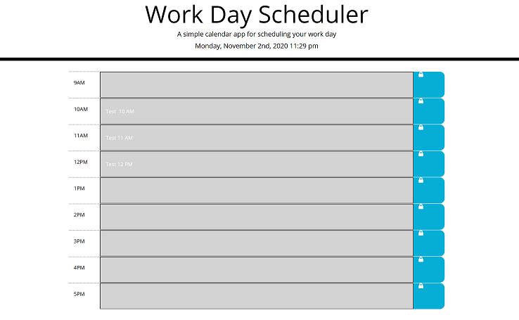

# Work Day Scheduler

## Description
This is a calendar application that allows a user to save planned events for each hour of the work day. This application has been developed using HTML, CSS, JavaScript, jQuery and MomentJS JavaScript library. This app will run in the browser and features dynamically updated HTML and CSS powered by jQuery. 

User can use this daily work day planner to create a daily schedule. The user is presented with hourly time blocks for standard business hours. Each time block is color-coded to indicate whether it is in the past (grey), present (red), or future (green). User can click into each time block, enter an event and click save button to store the event text in local storage. The stored events persist upon page refresh.

This source code is available to everyone under the standard MIT license.

Technologies Used: HTML5, CSS3, JavaScript, jQuery, MomentJS.

## Installation

To install this code, download the zip file and extract the files to a designated directory on your web server or computer without changing the directory/folder structure, or use GitHub's guidelines to clone the repository. 

## Screenshot of the application:

## Link to deployed website:
https://nagck.github.io/dayplanner

## Usage 

The application can be accessed via any standard browser on any device supported by the browser.

## Credits

- The website has been primarily developed using HTML5, CSS3, JavaScript, jQuery, MomentJS. 

- Sincere thanks to my course instructors Ed (Edward Apostol), Adam (Adam El-Masri), Anas (Anas Qazi) and Herman (German Arcila) for teaching and helping me in acquring HTML/CSS/JavaScript/jQuery skills. And of course thanks to my fellow students for sharing valuable tips and tricks on Slack study groups.

- Here are some websites that I referred to develop the application code:
    * https://www.w3schools.com/js/default.asp
    * https://developer.mozilla.org/en-US/docs/Web/JavaScript
    * https://getbootstrap.com/
    * https://www.w3schools.com/css/default.asp
    * https://css-tricks.com/
    * https://momentjs.com/
    * https://jquery.com/

## License
Licensed under the [MIT](https://choosealicense.com/licenses/mit/) license.

## Feedback
Feedback is always appreciated. If you are interested in fixing any issues and contributing directly to the code base, please provide at  https://github.com/nagck/dayplanner/pulls

---

